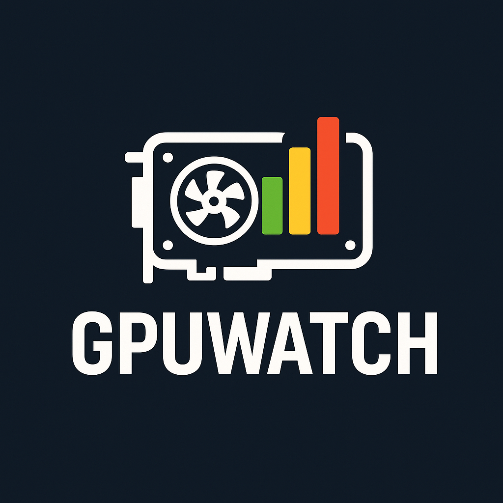
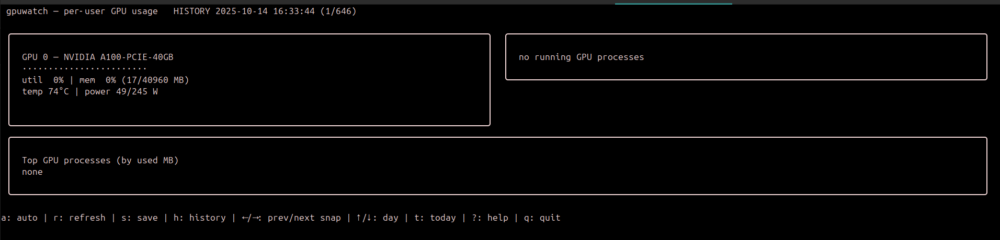

# gpuwatch



**gpuwatch** is a beautiful and modular terminal-based application written in Go that monitors **GPU usage per user**, displays it live in a TUI (Terminal User Interface), and saves usage history for browsing by date—all inside the terminal.  
Powered by [Bubble Tea](https://github.com/charmbracelet/bubbletea), [Lip Gloss](https://github.com/charmbracelet/lipgloss), and SQLite.

---

## Features

- **Live GPU Monitoring:**  
  See detailed GPU stats and per-user memory usage in real time (via `nvidia-smi`).

- **User Breakdown:**  
  Aggregates running processes on each GPU and maps them to users.

- **Historical Browsing:**  
  All usage snapshots are stored; navigate through any day and view every snapshot.

- **Elegant Terminal UI:**  
  Beautiful, colorful, and informative display with keybindings for productivity.

- **Portable and Modular:**  
  Clean architecture—easy to extend and modify for your cluster or desktop setup.

---

## screenshot




## Installation

### Prerequisites

- **Go 1.21+** (recommended: Go 1.22 or newer)
- Linux (tested), with NVIDIA drivers and `nvidia-smi` available in PATH
- `gcc` (for go-sqlite3, if not present: `sudo apt install build-essential`)
- Optional: color-capable terminal (for best UI experience)

### Build

```bash
git clone hhttps://github.com/iranailab/gpu-tracker
cd gpu-tracker

go mod tidy
go build -o gpuwatch ./cmd/gpu-tracker
````

### Run

```bash
./gpuwatch
```

> On first run, the app creates its database in `~/.local/share/gpuwatch/gpuwatch.db`.

---

## Usage

**Key bindings inside the TUI:**

| Key     | Action                                 |
| ------- | -------------------------------------- |
| `a`     | Toggle auto-recording (live, every 5s) |
| `r`     | Refresh snapshot once                  |
| `s`     | Save a snapshot manually               |
| `h`     | Toggle History mode                    |
| `← / →` | Prev/Next snapshot (in History)        |
| `↑ / ↓` | Prev/Next day (in History)             |
| `t`     | Jump to today/live mode                |
| `q`     | Quit                                   |
| `?`     | Toggle help overlay                    |

---

## How It Works

* **Sampling:**
  The app runs `nvidia-smi` to capture GPU/process stats. For each process, it maps PID → UID (via `/proc/<pid>/status`) → username (`/etc/passwd`).
* **History:**
  Snapshots are saved to SQLite on disk. Auto-recording can be toggled or snapshots saved manually.
* **Browsing:**
  Switch to history mode and browse by day/snapshot, all within the TUI.
* **Extensible:**
  Sampler and database logic are separated—add support for AMD (ROCm), NVML, or other GPUs easily.

---

## Project Structure

```
.
├── cmd/
│   └── gpuwatch/       # App entry point (main.go)
├── internal/
│   ├── sampler/        # GPU/process sampling logic
│   ├── store/          # SQLite storage abstraction
│   ├── tui/            # TUI (Bubble Tea) code
│   ├── types/          # Shared types & models
│   └── util/           # Helpers (e.g., PID->User)
├── go.mod
├── go.sum
└── README.md
```

---

## Troubleshooting

* **Go version too old:**
  See your Go version with `go version`. For Go < 1.21, [download a new version here](https://go.dev/dl/).

* **Permission errors:**
  Make sure you own all files (use `chown`) and build/run as your regular user, not root.

* **GLIBC errors on run:**
  Build and run the binary on the same Linux distribution.

---

## License

MIT License.
See [LICENSE](./LICENSE) for details.

---

## Credits

* [Bubble Tea](https://github.com/charmbracelet/bubbletea)
* [Lip Gloss](https://github.com/charmbracelet/lipgloss)
* [go-sqlite3](https://github.com/mattn/go-sqlite3)

---

## Author

Developed by [Alireza Parvaresh](https://github.com/parvvaresg)
Contributions welcome!

Made with love in Iran ❤️
---

